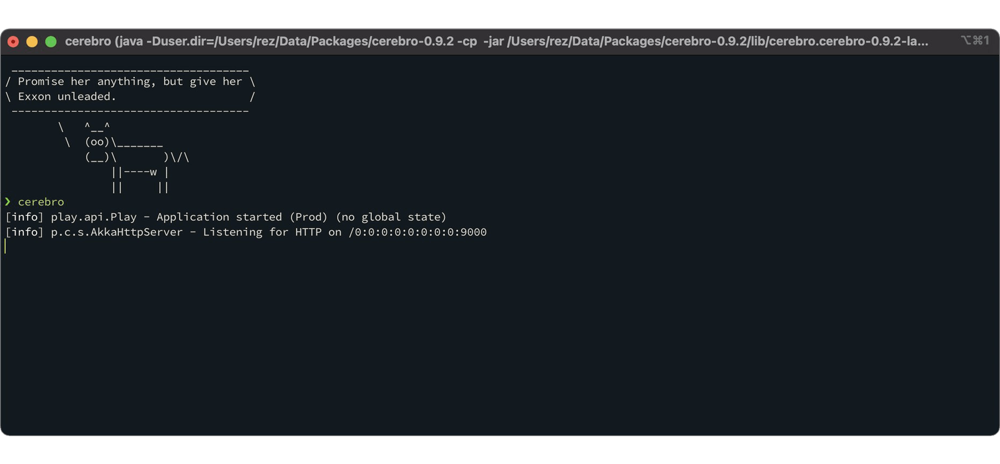

## About Me

I'm a DevOps Engineer with a background in Software Development, Cloud Computing, and Cybersecurity. My journey in IT has given me experience across the software delivery lifecycle, from building applications to designing and maintaining reliable, automated infrastructure.

🚀 What I Do

I currently focus on:

- 🔧 CI/CD automation and DevSecOps practices
- ☁️ Cloud infrastructure on AWS and GCP
- 🐳 Containerization and orchestration
- 🏗️ Infrastructure as Code
- 🔐 DevSecOps and application security
- 📊 Improving software delivery, reliability, and scalability

🛠️ Technologies & Tools

Cloud & Infrastructure
AWS · GCP · Terraform

Containers & Orchestration
Docker · Kubernetes · Helm

CI/CD & DevOps
Gitlab CI · Jenkins · Nexus Repository

Security & Quality
Aqua Security · Trivy · SonarQube · OpenText Fortify on Demand · Semgrep · Gemnasium Dependency Scanning

Development Background
Angular · Vue.js · Laravel · Node.js · Python · Flutter · Go

🌱 Beyond DevOps

Before focusing on DevOps, I worked with a range of technologies across frontend, backend, and mobile development. This background helps me understand the full software development lifecycle and build infrastructure that better supports development teams.

💡 My goal is to bridge development and operations by building secure, automated, scalable, and reliable systems.

📫 Feel free to connect with me or explore my repositories!

###### 🌚 I'm a Nocturn and Loving Cats 🐈.

